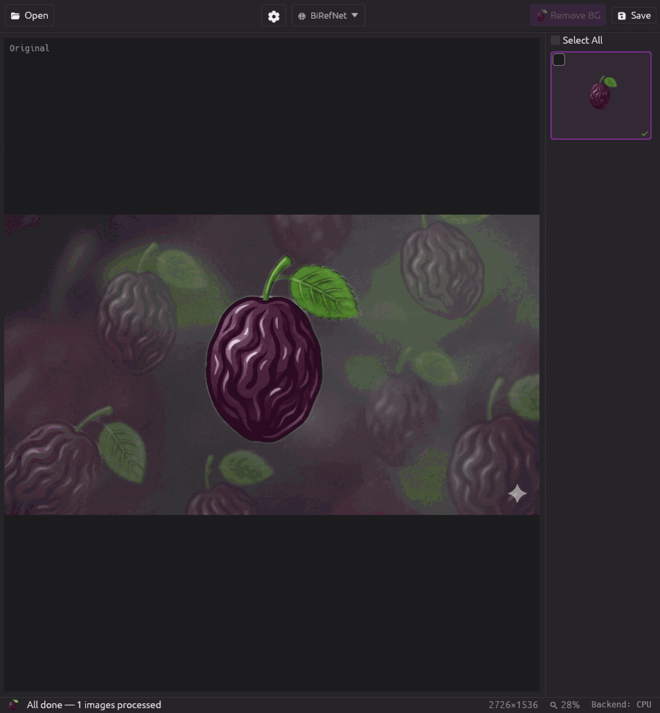

<h1>&nbsp;Prunr</h1>

Local AI background removal. One binary, no cloud, no API keys.

Prunr removes backgrounds from images using ONNX neural networks running entirely on your machine. Ships as a single binary with embedded models — download, run, done. GUI and CLI in the same executable.

Website: [prunr.io](https://prunr.io/)

<p align="center">
  
</p>

## Download

### Linux (x86_64)

| Format | Link |
|--------|------|
| AppImage (any distro) | [Prunr-x86_64.AppImage](https://github.com/aktiwers/prunr/releases/latest/download/Prunr-x86_64.AppImage) |
| Debian / Ubuntu | [.deb](https://github.com/aktiwers/prunr/releases/latest/download/prunr-linux-x86_64.deb) |
| Fedora / RHEL / openSUSE | [.rpm](https://github.com/aktiwers/prunr/releases/latest/download/prunr-linux-x86_64.rpm) |
| Portable | [tar.gz](https://github.com/aktiwers/prunr/releases/latest/download/prunr-linux-x86_64.tar.gz) |

The .deb / .rpm packages declare their runtime deps. If you use the
AppImage or tar.gz on a minimal install and hit a missing-library error,
install: `libgtk-3-0`, `libxkbcommon0`, `libfontconfig1`. Already present
on Ubuntu 22.04+ / Fedora 40+ / openSUSE Tumbleweed.

### macOS (Apple Silicon)

| Format | Link |
|--------|------|
| Disk image | [Prunr-macos-aarch64.dmg](https://github.com/aktiwers/prunr/releases/latest/download/Prunr-macos-aarch64.dmg) |
| Homebrew | `brew install aktiwers/prunr/prunr` |
| Portable | [tar.gz](https://github.com/aktiwers/prunr/releases/latest/download/prunr-macos-aarch64.tar.gz) |

### Windows (x86_64)

| Format | Link |
|--------|------|
| Installer | [prunr-windows-x86_64-setup.exe](https://github.com/aktiwers/prunr/releases/latest/download/prunr-windows-x86_64-setup.exe) |
| Portable | [zip](https://github.com/aktiwers/prunr/releases/latest/download/prunr-windows-x86_64.zip) |

All releases: [github.com/aktiwers/prunr/releases](https://github.com/aktiwers/prunr/releases)

## Features

- **Three bundled models** — Silueta (fast), U2Net (quality), BiRefNet-lite (best detail at 1024×1024)
- **Line extraction** — edges/outlines via DexiNed, standalone or combined with background removal
- **GPU acceleration** — CUDA, CoreML, DirectML, with automatic CPU fallback
- **Batch processing** — parallel inference across multiple images, switch between them while they work
- **Mask tuning** — removal strength, hard cutoff, edge shift, guided filter for fine detail
- **Drag-and-drop** — in and out of the window (drop into Finder/Explorer/Word/PowerPoint)
- **No cloud** — everything runs locally, no telemetry, no API keys

## CLI

The binary runs headless when given image arguments:

```bash
prunr photo.jpg                 # saves photo_nobg.png
prunr *.jpg -o clean/           # batch to a folder
prunr -m u2net portrait.jpg     # quality model
prunr -j 4 *.jpg -o out/        # 4 parallel jobs
prunr --lines logo.png          # line extraction only
```

Common flags:

| Flag | Description |
|------|-------------|
| `-o, --output <PATH>` | Output file or directory |
| `-m, --model <MODEL>` | `silueta` (default), `u2net`, `birefnet-lite` |
| `-j, --jobs <N>` | Parallel jobs (default: 1) |
| `-f, --force` | Overwrite existing output |
| `--cpu` | Force CPU inference |
| `--gamma <N>` | Removal strength (default: 1.0) |
| `--threshold <N>` | Hard cutoff (0.0–1.0) |
| `--refine-edges` | Guided filter for fine detail (hair, leaves) |
| `--lines` | Extract lines/edges only |
| `--bg-color <HEX>` | Fill transparent background (e.g. `ffffff`) |

`prunr --help` for the full list.

## Models

| Model | Size | Resolution | Best for |
|-------|------|-----------|----------|
| Silueta | ~4 MB | 320×320 | Fast, clean subjects (default) |
| U2Net | ~170 MB | 320×320 | Better edges |
| BiRefNet-lite | ~214 MB | 1024×1024 | Fine detail (hair, leaves) |

All models are embedded in the binary — no downloads after install.

## GPU Acceleration

Prunr picks the best available backend automatically:

1. **CUDA** (Linux/Windows, NVIDIA)
2. **CoreML** (macOS, Apple Silicon Neural Engine)
3. **DirectML** (Windows, AMD/Intel)
4. **CPU** (always available, automatic fallback)

The active backend is shown in the status bar.

## Build from Source

Requires Rust 1.75+ and (on Linux) GTK3 development libraries.

```bash
cargo xtask fetch-models                          # one-time, ~174 MB
cargo run -p prunr-app --features dev-models      # dev mode
cargo build --release -p prunr-app                # release binary
```

See [ARCHITECTURE.md](ARCHITECTURE.md) for internals.

## License

Apache-2.0 — see [LICENSE](LICENSE).
