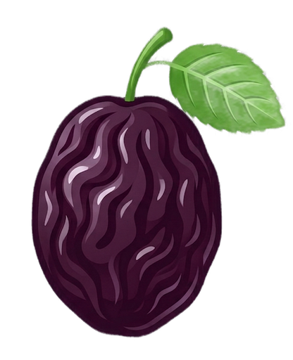

#  Prunr

Local AI background removal. One binary, no cloud, no API keys.

Prunr removes backgrounds from images using ONNX neural networks running entirely on your machine. It ships as a single binary with embedded models — download, run, done.

## Download

| Platform | Installer | Portable |
|----------|-----------|----------|
| **Linux** | [AppImage](https://github.com/aktiwers/prunr/releases/latest/download/Prunr-x86_64.AppImage) \| [.deb](https://github.com/aktiwers/prunr/releases/latest/download/prunr-linux-x86_64.deb) | [tar.gz](https://github.com/aktiwers/prunr/releases/latest/download/prunr-linux-x86_64.tar.gz) |
| **macOS** (Apple Silicon) | [DMG](https://github.com/aktiwers/prunr/releases/latest/download/Prunr-macos-aarch64.dmg) | [tar.gz](https://github.com/aktiwers/prunr/releases/latest/download/prunr-macos-aarch64.tar.gz) |
| **Windows** | [Installer](https://github.com/aktiwers/prunr/releases/latest/download/prunr-windows-x86_64-setup.exe) | [zip](https://github.com/aktiwers/prunr/releases/latest/download/prunr-windows-x86_64.zip) |

Or browse all releases: [github.com/aktiwers/prunr/releases](https://github.com/aktiwers/prunr/releases)

## Features

- **GUI and CLI** in one binary — `prunr` opens the GUI, `prunr photo.jpg` runs headless
- **Three bundled models** — Silueta (~4 MB, fast), U2Net (~170 MB, quality), BiRefNet-lite (~214 MB, best detail at 1024×1024)
- **GPU acceleration** — CUDA (Linux/Windows), CoreML (macOS), DirectML (Windows), with automatic CPU fallback
- **Batch processing** — open multiple images, process in parallel, save all to a folder
- **True parallel processing** — start processing multiple images independently, switch between them while AI works
- **Mask tuning** — removal strength, hard cutoff threshold, edge refinement, guided filter edge sharpening
- **Undo/Redo** — Ctrl+Z reverts to original, Ctrl+Y restores the processed result from memory
- **Crossfade transition** — smooth fade from original to result when processing completes
- **Persistent settings** — model choice, parallel jobs, mask tuning saved between sessions
- **Drag-and-drop** — drop images onto the window to queue them (X11; Wayland pending winit support)
- **Toast notifications** — animated feedback for save, copy, process complete, errors
- **Material Design icons** — crisp vector icons throughout the UI (via egui_material_icons)
- **Non-blocking architecture** — all image decoding, saving, and thumbnail generation runs on background threads
- **Keyboard-driven** — full shortcut set for power users
- **Cross-platform** — Linux x86_64, macOS x86_64/aarch64, Windows x86_64
- **Formats** — PNG, JPEG, WebP, BMP input; PNG output (transparent background)

## Quick Start

### Prerequisites

- Rust toolchain (1.75+)
- On Linux: GTK3 development libraries for file dialogs

### Build and Run

```bash
# 1. Fetch models (one-time, downloads ~174 MB)
cargo xtask fetch-models

# 2. Run the GUI (dev mode — loads models from filesystem)
cargo run -p prunr-app --features dev-models

# 3. Or build a release binary (models embedded in binary)
cargo build --release -p prunr-app
./target/release/prunr
```

## GUI

Launch with no arguments:

```bash
prunr
```

### Toolbar

| Button | Description |
|--------|-------------|
| **Open** | Open one or more images (multi-select supported) |
| **Settings** | Open settings dialog (center) |
| **Model** | Switch between Silueta (fast), U2Net (quality), BiRefNet (detail) |
| **Remove BG** / **Process Selected** | Process current image, or all checked images in parallel |
| **Process All** | Process all queued images in parallel (appears with 2+ images) |
| **Save** / **Save Selected** | Save current result, or all checked results to a folder (appears when result ready) |
| **Remove Selected** | Remove all checked images from the sidebar (appears when any are checked) |

### Sidebar

The sidebar appears on the right when any images are loaded. Each thumbnail shows:

- **Status indicator** (bottom-right) — gray dot (pending), pulsing purple dot (processing), green checkmark (done), red error icon
- **Selection checkbox** (top-left) — check to include in batch operations
- **Delete button** (top-right, on hover) — trash icon to remove individual image
- **Save button** (bottom-left, on hover) — save icon to export individual processed image
- **Processing animation** — purple shimmer sweep + pulsing border while AI is working
- **Loading spinner** — shown while thumbnail is being decoded in background
- **Fade-in** — 200ms fade when thumbnail loads or image switches

At the top: **Select All** checkbox (toggles all on/off).

Click a thumbnail to view it on the canvas with a smooth fade transition. Drag to reorder. Thumbnails update to show the result after processing.

### Settings

Open with the gear button or `Ctrl+Space` (`Cmd+Space` on macOS):

| Setting | Description |
|---------|-------------|
| **Model** | Silueta (fast), U2Net (quality), or BiRefNet-lite (best detail) |
| **Auto-remove on import** | Automatically process images when added to the queue |
| **Parallel jobs** | Number of images to process simultaneously (1 to CPU count) |
| **Inference backend** | Shows active GPU/CPU backend (read-only) |

### Keyboard Shortcuts

| Shortcut | Action |
|----------|--------|
| `Ctrl+O` | Open file(s) |
| `Ctrl+R` | Remove background |
| `Ctrl+S` | Save result |
| `Ctrl+C` | Copy result to clipboard |
| `Ctrl+Z` | Undo background removal |
| `Ctrl+Y` | Redo (restore result from memory) |
| `Escape` | Cancel processing / close dialog |
| `F1` | Show keyboard shortcuts |
| `F2` | Show CLI reference |
| `B` | Toggle before/after comparison |
| `← / → or A / D` | Previous / next image in batch |
| `Ctrl+0` | Fit image to window |
| `Ctrl+1` | Actual size (1:1 pixels) |
| `Tab` | Show/hide batch queue sidebar |
| `Ctrl+Space` | Open settings |
| `Click+drag` | Pan image |
| `Scroll wheel` | Zoom in/out (cursor-centered) |

On macOS, replace `Ctrl` with `Cmd`.

## CLI

Pass image files directly — no subcommand needed:

```bash
prunr photo.jpg                    # saves photo_nobg.png alongside input
prunr photo.jpg -o result.png      # custom output path
prunr *.jpg -o clean/              # batch to folder
prunr -m u2net portrait.jpg        # use quality model
prunr -j 4 *.jpg -o out/           # 4 parallel jobs
```

### Full CLI Reference

```
prunr [OPTIONS] [INPUTS]...
```

| Option | Description |
|--------|-------------|
| `[INPUTS]...` | Input image file(s) |
| `-o, --output <PATH>` | Output file (single) or directory (batch) |
| `-m, --model <MODEL>` | `silueta` (default, fast), `u2net` (quality), or `birefnet-lite` (best detail) |
| `-j, --jobs <N>` | Parallel inference jobs (default: 1) |
| `--large-image <MODE>` | `downscale` (default) or `process` (full size) |
| `-f, --force` | Overwrite existing output files |
| `-q, --quiet` | Suppress progress output |
| `--gamma <N>` | Removal strength (default: 1.0). >1 = more aggressive, <1 = gentler |
| `--threshold <N>` | Binary cutoff (0.0–1.0). Pixels below become fully transparent |
| `--edge-shift <N>` | Edge refinement in pixels. Positive erodes, negative dilates |
| `--refine-edges` | Guided filter for fine edge detail (hair, leaves) |
| `-h, --help` | Print help |
| `-V, --version` | Print version |

### Examples

```bash
# Single image with quality model
prunr -m u2net portrait.jpg

# Batch with parallel jobs, force overwrite
prunr -j 8 -f photos/*.jpg -o clean/

# Large image at full resolution
prunr --large-image process poster.png

# Aggressive removal with hard cutoff
prunr --gamma 2.0 --threshold 0.5 photo.jpg

# Gentle removal with expanded edges
prunr --gamma 0.5 --edge-shift -2 portrait.jpg

# Quiet mode for scripting
prunr -q photo.jpg -o output.png
```

## Project Structure

```
prunr/
├── crates/
│   ├── prunr-core/       # Inference pipeline, image I/O, batch processing
│   ├── prunr-models/     # Model embedding (zstd-compressed ONNX, ~174 MB)
│   └── prunr-app/        # Single binary: GUI (egui) + CLI (clap)
├── xtask/                   # Developer tooling (cargo xtask fetch-models)
├── models/                  # ONNX model files (.gitignored)
├── ARCHITECTURE.md          # Detailed architecture documentation
└── README.md                # This file
```

### Crate Dependencies

```
prunr-models  (standalone — no workspace deps)
      |
      v
prunr-core    (inference pipeline)
      |
      v
prunr-app     (GUI + CLI binary)
```

## Models

| Model | Size | Resolution | Speed | Quality | Default |
|-------|------|-----------|-------|---------|---------|
| **Silueta** | ~4 MB | 320×320 | Fast | Good for clean subjects | Yes |
| **U2Net** | ~170 MB | 320×320 | Slower | Better edge detail | No |
| **BiRefNet-lite** | ~214 MB | 1024×1024 | Slowest | Best for fine detail (hair, leaves) | No |

All models are ONNX format. Silueta and U2Net are compatible with rembg's preprocessing. BiRefNet-lite uses standard ImageNet normalization with sigmoid output.

## GPU Acceleration

Prunr automatically selects the best available inference backend:

1. **CUDA** (Linux/Windows with NVIDIA GPU)
2. **CoreML** (macOS — Neural Engine on Apple Silicon)
3. **DirectML** (Windows — AMD/Intel GPUs)
4. **CPU** (always available, automatic fallback)

The active backend is shown in Settings. No configuration needed — it just works.

## Development

```bash
# Run with dev-models feature (loads models from disk, faster iteration)
cargo run -p prunr-app --features dev-models

# Run tests
cargo test --workspace

# Fetch models (required before first build without dev-models)
cargo xtask fetch-models
```

## License

MIT OR Apache-2.0
